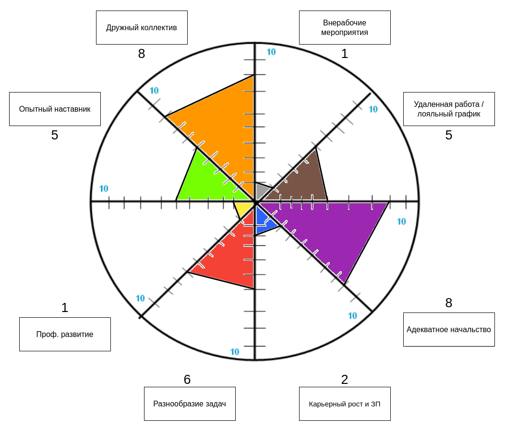
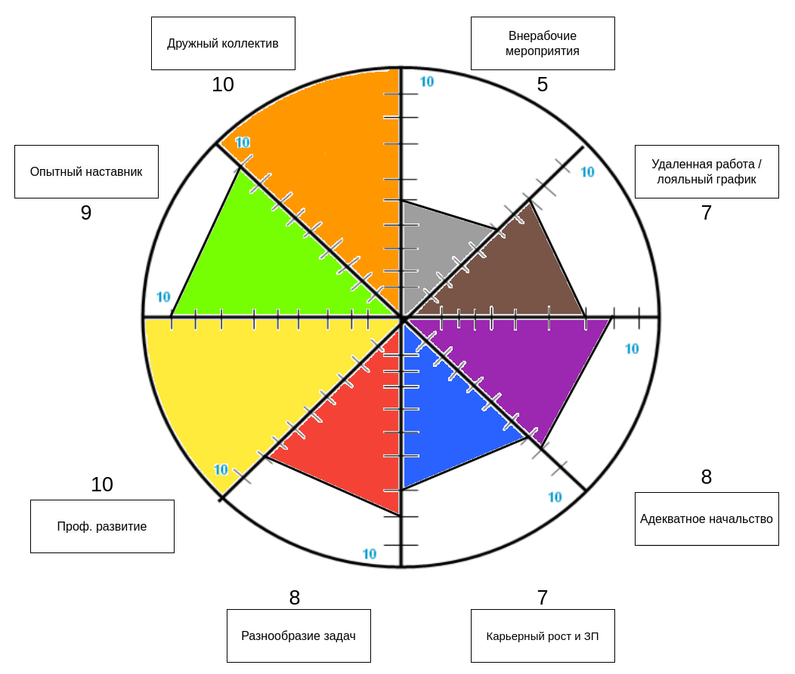
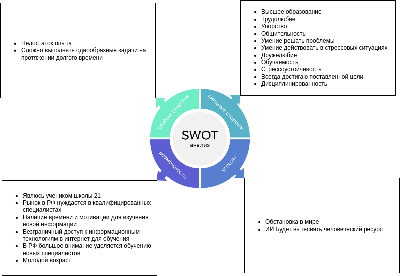

   

<h1 align="center">Карьерные цели</h1>

# Цели в карьере и карьерные приоритеты

В следующих двух главах я расскажу о моих приоритетах в выборе работы и о карьерных целях.

## Колесо карьерных приоритетов

А данной главе хотел бы дать сравнение двум колесам приоритетов, а именно: колесо приоритетов на последнем долгосрочном месте работы и идеальное колесо приоритетов. Также дам оценку, почему и как оценены приоритеты в идеальном колесе, и распишу возможные шаги для достижения цели.

**Дам краткое описание оценок с предыдущего места работы:**

- "Опытный наставник": Наставник был только на первых этапах работы.
- "Дружный коллектив": Коллектив был достаточно дружным, часто собирались вместе после работы.
- "Внерабочие мероприятия": Мероприятия ограничивались только корпоративами.
- "Удаленная работа/лояльный график": График не был удаленным, при необходимости можно было отлучиться или отпроситься.
- "Адекватное начальство": Начальство было замечательным.
- "Карьерный рост и ЗП": Карьерный рост был очень узким с малым прибавлением ЗП, ЗП прибавляли только в связи с инфляцией.
- "Разнообразие задач": Задачи были достаточно разнообразными.
- "Профессиональное развитие": Происходило только за счет собственных усилий.

Теперь хотелось бы показать идеальное колесо приоритетов.

**Дам описание, почему именно такие оценки я считаю перспективными и оптимальными:**

- "Опытный наставник": Наставник — это тот человек, который напрямую влияет на твое профессиональное развитие. Считаю, что наставник должен быть у любого начинающего специалиста. По сложным вопросам сможет подсказать только опытный специалист.
- "Дружный коллектив": Рабочий коллектив — это вторая семья. На работе мы проводим треть времени в сутках, хотелось бы, чтобы окружение было для меня близко, как лучшие друзья.
- "Внерабочие мероприятия": Я считаю, что хорошее предприятие должно заботиться о развитии отношений в коллективе, а прямой путь для этого — это внерабочие мероприятия.
- "Удаленная работа/лояльный график": Бывают разные жизненные ситуации, и если начальство отпустит в непредвиденной ситуации, то это всегда плюс работодателю. А если получится пару раз за неделю поработать из дома, то работник будет меньше выгорать от рабочей обстановки.
- "Адекватное начальство": Начальство — это не только тот, кто командует, но и тот, кто берет на себя ответственность за своих подчиненных.
- "Карьерный рост и ЗП": Если у человека нет цели в жизни, то он просто прожигает свою жизнь, так же происходит и на работе.
- "Разнообразие задач": Чем больше разных задач приходится выполнять, тем интереснее работа. Если каждый день делать одно и то же, то есть шанс выгореть за пару дней.
- "Профессиональное развитие": Считаю, что работодатель должен поощрять и подталкивать своих работников на профессиональное развитие, ведь чем опытнее и квалифицированнее сотрудник, тем он ценнее.

**Возможные варианты действий для улчшения показателей колеса:**

- "Опытный наставник": Начальство должно закреплять за каждым неопытным сотрудником наставника. Начальство должно постоянно интересоваться положением дел у наставника и его подопечных, возможно, в этом помогут небольшие брифы с наставниками.
- "Дружный коллектив": Коллектив должен устраивать встречи, ходить вместе на обед, собираться на выходных, почему бы в пятницу не сходить всем коллективом в бар?
- "Внерабочие мероприятия": Большинство людей занимается спортом. Компания должна организовывать спортивные мероприятия по увлечениям. Также возможно, нужно организовывать мероприятия по другим увлечениям, почему бы не отправить своих работников в кино или театр на выходных?
- "Удаленная работа/лояльный график": Считаю, что работодатель может в большинстве случаев предоставить работнику пару рабочих дней из дома.
- "Адекватное начальство": Почему Суворов обедал солдатской кашей в окружении обычных рядовых? Надо быть ближе к народу.
- "Карьерный рост и ЗП": Работник должен поставить цель и отслеживать ее. Считаю, что работодатель может организовывать мотивационные мероприятия для поддержания интереса развития у работников.
- "Разнообразие задач": Чем больше разных проектов у работника, тем интереснее рабочая деятельность. Главное знать грань. Человек не вода, не сможет точить камень.
- "Профессиональное развитие": Работодатель должен отправлять на курсы повышения квалификации, поддерживать рвение работника развиваться в профессиональном направлении.

## Постановка карьерной цели

В данной главе опишу карьерные цели на 1-2 года, 4-5 лет, состояние на данный момент времени, и глобальную цель.

| Глобальная цель (мечта) | Данный момент | 1-2 года | 4-5 лет |
| --- | --- | --- | --- |
Организовать свой стартап. Стартап должен приносить стабильный доход. Выстроить идеальные условия внутри команды. | Являюсь учеником школы 21. Дополнительно решаю задачи на CodeWars в свободное время. Стэк моих знаний состоит из С, SQL, C++. Немного знаю Qt. Есть учебное портфолио. | Закончить основное обучение в школе 21, но продолжать учиться на дополнительной ветке и продолжать развиваться на сторонних ресурсах. Устроиться на стажировку, а потом на работу в хорошую компанию, соответствующую моим требованиям. Выйти на стабильный доход. Найти новые знакомства в сфере IT. Увеличивать портфолио. Нарабатывать навык решения рабочих задач, увеличивать опыт работы. | Есть два варианта развития событий. 1 - Стать опытным разработчиком или тим лидом в большой и разносторонней IT компании с хорошим заработком. 2 - Создать свой стартап или фирму в сфере IT. Предоставлять хорошие рабочие места, иметь полезный для общества продукт. И в первом, и во втором случае компания должна полностью соответствовать моим ожиданиям в компании, которые описаны в предыдущей части.

##  Анализ навыков

В данной главе дам анлиз моих навыков с помошью SWOT анализа. SWOT-анализ — метод анализа, заключающийся в выявлении факторов внутренней и внешней среды организации и разделении их на четыре категории:

- Strengths (сильные стороны)
- Weaknesses (слабые стороны)
- Opportunities (возможности)
- Threats (угрозы)

